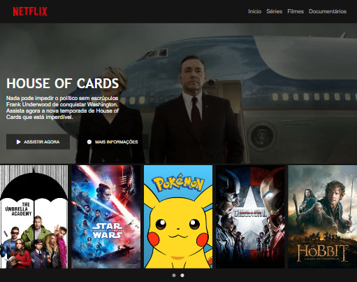

# Clone Netflix

  

Projeto desenvolvido em uma das aulas do curso HTML Web Developer da Digital Innovation One. 

### Técnologias utilizadas:

* HTML 
* CSS
* JAVASCRIPT

### O que foi aprendido:

Como estruturar um layout, técnicas de CSS3 com containers e variáveis, como posicionar os elementos com Flexbox e como utilizar plugins Jquery a favor da sua aplicação.